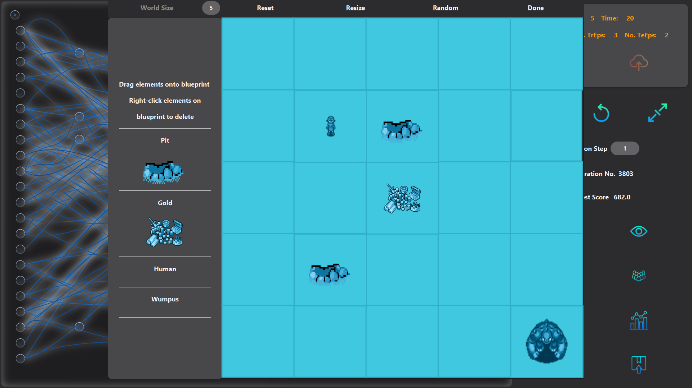
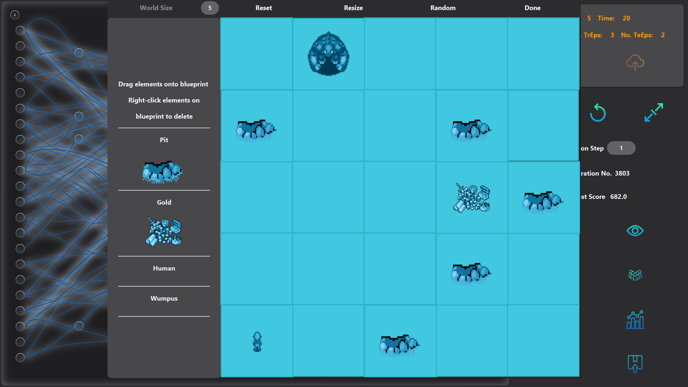
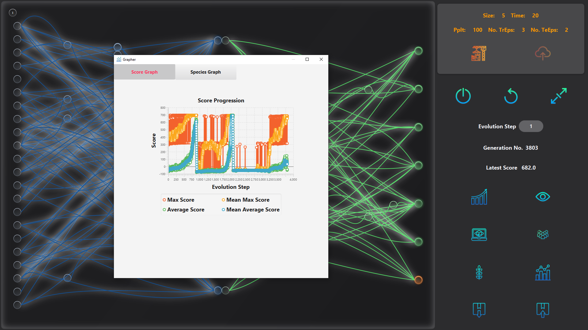

# Research Project: Generative Adversarial in Augmenting Mutation-Evolution (GAAME)
### Author: Truong Nguyen Huy
### Major: Computer Science - Software Engineering
#### @ University of Illinois at Chicago

## Description:

This research adopts the Wumpus World concept in Artificial Intelligence by Michael Genesereth, 
and the wumpuslite Java frame (designed by Professor James P. Biagioni in Artificial Intelligence II at UIC) as the environment (task). 
I want to design agent functions that can solve this task. 
With Professor Piotr Gmytrasiewicz’s advisory, I have added the factor of Multi-Agent and Dynamic to this Partially Observable and Continuous environment by implementing the Wumpus as a simple-reflex agent. 
The expected product of this research is a Reinforcement Learning technique that can aid programmers in culturing their space of strategies/solutions to real-world problems. 
In this project, I propose artificial neural networks (ANN) as the basis of rationality for participating agents, i.e. the human and Wumpus agent functions. 
Throughout this description, I will be using neural networks and solutions interchangeably.

Here is a briefing on the background of the Wumpus World environment:
1. The utility of the human agent is to maximize its performance measure by reaching the gold as fast and safest as possible (should learn to avoid death by Wumpus or bottomless pits).
2. **[Personal design]** The utility of the Wumpus agent is to maximize its performance measure by terminating the human agent as fast and safest as possible (should learn to avoid death by human arrows). 
3. The human has a number of perception capabilities: smelling Wumpus's stench, feeling pit's breeze, seeing gold's glitter, feeling cave border collisions, hearing Wumpus's death scream. 
4. **[Personal design]** The Wumpus has a number of perception capabilities: smelling the human's sense direction and intensity where the human has come across.
5. The human is allowed to perform a number of actions: turning left/right, moving forward, shooting arrows, bending down for gold, and doing nothing (skipping turn).
6. **[Personal design]** The Wumpus is allowed to perform a number of actions: moving in the 4 standard axis-directions.

The research goal is to have these ANN-based agents exhibit an underlying capabilities of logical reasoning and strategic planning in order to maximize their utilities. That is, the agents should have the capabilities of the following agent types:
1. Model-based reflex (able to keep track of the changes in the partially observable environment), 
2. Utility-based (able to consider the best way to achieve its self-established goal), 
3. And Learning (able to learn from past episodic experiences).

---------------------------------------------------------------------------------------------------------------------------------------------------------------------------------
## Summary on Accomplishments:

During the configuration and revising of my research project, I have read numerous research resources in the AI, specifically the Reinforcement Learning, domain to inspect if state-of-the-art theories are compatible with my framework and if they could solve performance roadblocks. This research project has earned me my Capstone graduation from the UIC Honors College. I am currently extending this framework for the Master’s Thesis at my UIC Graduate program.

•	I have drawn experiences in the evolutionist AI approach from the paper Neural Evolution of Augmenting Topologies (NEAT), and its referenced materials. By randomly mutating and permuting neural structures piecewise, high-performing ANN architectures are discovered. After training, networks leverage their topologically addressable flow-paths and learn hyperplanes of the latent manifolds to aid them during testing episodes. My personal design decision was that all submodules, including LSTM gates, Actor, and Critic networks, share the same architectures but learn independent latent structures. Overall, NEAT contributes the foundation to regulate wide structural priors of neural networks to my research.

•	I have also extensively familiarized myself with the connectionist AI approach by conducting various independent studies and coursework on Deep Learning. I implement the NEAT apparatus to push deep learners with architectural sparsity constraints to perform generalization on observatory experiences from high dimensional input sensors. Under the deterministic dynamics of the Wumpus World hidden transition model, these parametrized models can locate the global maximum of the objective reward-based function. However, their interpolative faculties are confined to a restricted convex hull of observations drawn from sub-distributions of environmental configurations.

•	Due to the factorial volume of high-dimensionality observations drawn from arbitrarily configured environments, my generated models cannot locally interpolate beyond the sparse and rapidly shifting training distribution under fluctuant policies. Therefore, I delve into the idea of leveraging the preservative exploration faculties of deep learners by implementing my version of the Proximal Policy Optimization (PPO) and Intrinsic Curiosity Module (ICM). This contributes immensely to my model's exploration-driven behaviors and stability of learned policies.

•	Due to the intractable search space of piece-wise neural architectures, semi-directional architecture search, such as NEAT, may not always converge. I steer my studies towards adaptive generative models such as the Generative Adversarial Neural Architecture Search. My design decision is to implement GAN controllers that render a directional search and samples gradually towards the optimal distribution of piece-wise mutations. I am currently collaborating this framework onto the NEAT foundation of my research project.
My plan for this Reinforcement Learning theoretical framework is to leverage a problem's intrinsically interpolative nature. I want to encode the ability for deep models to traverse within the latent manifolds of the problem, sort of like "learning from imagination". Given that each network can produce action for interaction with the MDP's transition model, predict state value for learning, and predict subsequence observations via ICM, we reformulate that each network can act as transitional dynamic predictors. With this formulation, given an initial observation, each network can sample trajectories with this self-played transition model and learn from "imagined" experiences.
 
Preferences
Stanley, K. (n.d.). Evolving Neural Networks through Augmenting Topologies. The MIT Press Journals - Neural Network Research Group. Retrieved January 13, 2022, from http://nn.cs.utexas.edu/downloads/papers/stanley.ec02.pdf 
Staudemeyer, R. C., & Morris, E. R. (2019, September 12). Understanding LSTM -- a tutorial into long short-term memory recurrent neural networks. arXiv.org. Retrieved January 13, 2022, from https://arxiv.org/abs/1909.09586 
Mnih, V., Badia, A. P., Mirza, M., Graves, A., Lillicrap, T. P., Harley, T., Silver, D., & Kavukcuoglu, K. (2016, June 16). Asynchronous methods for deep reinforcement learning. arXiv.org. Retrieved January 13, 2022, from https://arxiv.org/abs/1602.01783 
Schulman, J., Wolski, F., Dhariwal, P., Radford, A., & Klimov, O. (2017, August 28). Proximal policy optimization algorithms. arXiv.org. Retrieved January 13, 2022, from https://arxiv.org/abs/1707.06347 
Pathak, D., Agrawal, P., Efros, A. A., & Darrell, T. (2017, May 15). Curiosity-driven exploration by self-supervised prediction. arXiv.org. Retrieved January 13, 2022, from https://arxiv.org/abs/1705.05363 
Rezaei, S. S. C., Han, F. X., Niu, D., Salameh, M., Mills, K., Lian, S., Lu, W., & Jui, S. (2021, June 23). Generative Adversarial Neural Architecture Search. arXiv.org. Retrieved January 13, 2022, from https://arxiv.org/abs/2105.09356 

---------------------------------------------------------------------------------------------------------------------------------------------------------------------------------

##### Figure 1: This is the login screen of the program. User can specify the Wumpus world size (dimension of the 2D square grid world); number of time steps (each time step is a time unit in a training/testing episode); max population (the number of solution architectures at any generation); and number of training/testing episodes (the number of chances each solution gets to improve itself and get evaluated). 

I implemented the NeuroEvolution of Augmenting Topologies (NEAT) algorithm proposed by Kenneth O. Stanley (to learn more, click [here](http://nn.cs.utexas.edu/downloads/papers/stanley.ec02.pdf)) as a control for non-deterministically producing agent functions. 
My version of NEAT implementation involves:

1. Initialize a population of primitively defined solution architectures/parameters
2. Speciate the population of architectures using a genomic distance function, 
3. Have individuals in a species train in the Wumpus environment
4. Yield high-performing individuals while evict low-performing ones
5. Terminate species that exceed the minimum threshold of individual counts, 
6. Finally, have successful species reproduce using a genetic algorithm to fill in the spot of evicted individuals. 

This implementation ensures that the inflow of newborn individual solutions and outflow of evicted solutions are maintained at consistent rates which sustains a stable population count. Moreover, speciation ensures the retention of a diverse population of solution architectures, thus, maintaining and developing a promising hypothesis space in parallel.

---------------------------------------------------------------------------------------------------------------------------------------------------------------------------------

At the design level of the solution architectures, a Long Short-Term Memory architecture (the Memory Head) feeds into an Actor-Critic-Seer architecture (Decision Head). 
The Memory Head needs to learn a sequential memory processor that maps from the space of observations and previously taken actions to the memory encoding space (hidden layer). 
The Decision Head needs to learn to map from this encoding space to the probabilistic distributions space representing the probabilities of different allowed actions (actor layer), 
a real-numbered space respresenting the state-value (critic layer), and a real-numbered tuple space representing the prediction of the next observation (seer layer). 
What are the details of these 3 output layers? 
The actor decides on the policy that the agent will be taking given the past observation sequences. It is trained using Vanilla Policy Gradient (VPG) method.
The critic estimates the state's values of environmental observation sequences. It is trained using Temporal Difference (TD-lambda) Learning. This value is used to train the actor, i.e. criticize the actor's decisions. 
The seer predicts next observations based on past observation sequences. This is used to form the Intrinsic Curiosity Module (ICM) for actor's curiosity-driven exploration. 
Conceptually, during SGD, after each end-to-end forward pass from percept history to action-probability-distribution, state-value-estimation, and next-state-prediction, 
the environment returns reward and next state which signals gradient for actor's training, MSE loss minimization for critic & seer's training. 
The total outputted gradients of these Decision subunits are back propagated through the Memory Head to train the LSTM gates.

##### Figure 2: The NEAT Lab that the user can evolve, reset, view, etc. The ANN being spotlighted on screen is the fittest solution after 100 generations. The blue area is the Memory Head while the green is Decision Head. The input layer consists of observation nodes, inflection nodes, and hidden nodes. At the output layer, the green nodes are the action probability distribution, the orange outputs the state-value estimation, and the violet outputs prediction for the next observation. The architectural information is shown and graphically highlighted when user hovers over a node or connection.

Crucial implementation decision: In the Memory Head, I decide that while each gate has its own set of parameters, internal & output states, their architectures are shared. 
Similarly, in the Decision Head, while actor, critic, and seer have their own respective set of parameters, internal & output states, actor shares the same architecture with the critic and seer with some minor differences in the output layer arrangements because actor is performing Logistic Classification and critic and seer are performing Regression.

---------------------------------------------------------------------------------------------------------------------------------------------------------------------------------

##### Figure 3: User can build a custom environment as illustrated in this UI during simulation (visualized testing mode) of an individual genome.

During competition between individuals within species in the population, each individual has to go through a user-specified number of training episodes, where parameters are trained, and then get evaluated in a user-specified number of testing episodes where exploration is banned and parameters are not changed. 
This happens in the background for each evolution step. However, user can view the testing of an individual by clicking on the Simulation button (the top-down second button on the left column). 
This will take the user to a blueprint environment scene where a world blueprint can be customized via the standard drag-drop UI.

##### Figure 4: A custom-built simulation scene. The circles on right panes represent the perception channels for the agents in the environment. The listviews below log each agent's action decisions, step-rewards, and Actor-Critic processes. It is observed that the probability distribution of action decision at each time step is uniform and state-value opinion is far off from the Temporal Difference target, this shows that the solution architecure is still simple. 

---------------------------------------------------------------------------------------------------------------------------------------------------------------------------------
## Summary on Current Results:

##### Figure 5: We start out with this custom environment to train the neural architectures in.

##### Figure 6: After successful convergence among the population on the first design, we switch the environment design to this one.

##### Figure 7: The orange line represents the smooth-out max score while the blue line represents the smooth-out population average at each generation. We observe that at first, the population of ANNs slowly obtains higher scores and max out at generation ~800. We then switch the environment to a new one which make their performance crashes steeply. However, overtime, they also learn to do better in this second environment at generation ~2000. We then switch back to the first environment and observe that they still manage to do well in the first one.

We conclude that the neurons in these ANNs have become multimodal. They manage to learn a strategy to win the second environment while still remembering how to solve the first one. 
When inspecting closer using the simulation functionality, we see that their solutions to the second environment is somewhat similar to their solutions for the first. 
We hypothesize that because these ANNs are initially "raised" on the first environment, their architectures are deeply influenced by it. 
Therefore, when moved to a new environment, they try to incorporate what they know from the first to solve this new one.

---------------------------------------------------------------------------------------------------------------------------------------------------------------------------------
## Next Steps:

We are implementing the GAN framework as a set of supervisor GCNs that can sample optimal mutations and sort out effective architectures in the ANN population.
