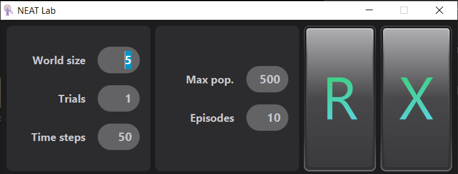
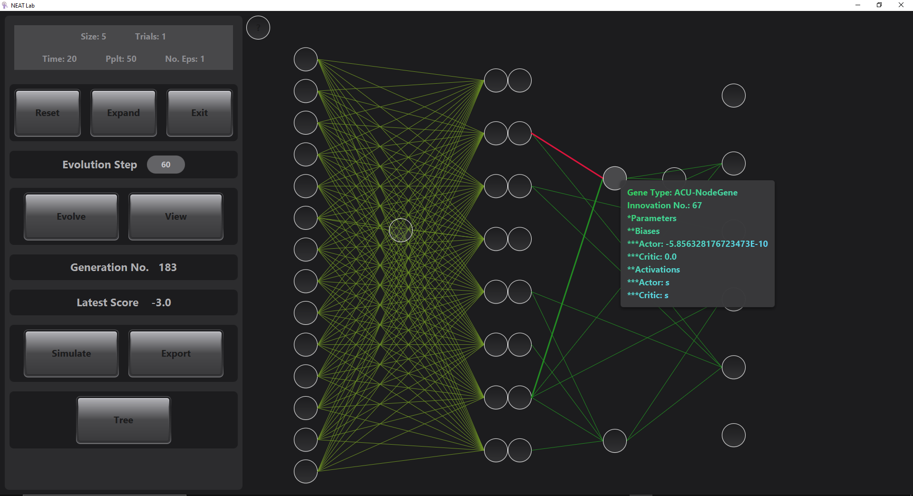
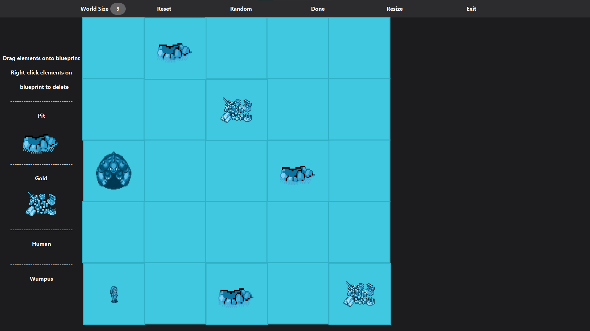
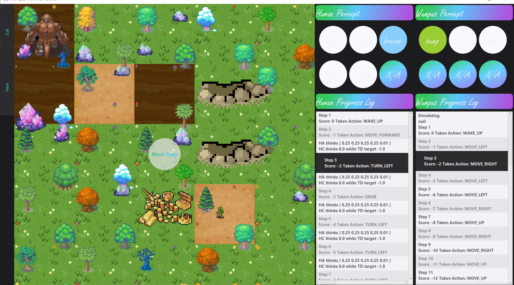

# Independent Research Project: Explore A NEAT-ly Wumpus Reinforcement Model
### Author: Truong Nguyen Huy
### Major: Computer Science - Software Engineering
#### @ University of Illinois at Chicago

This research adopts the Wumpus World concept in Artificial Intelligence by Michael Genesereth, the Wumpuslite model designed by Professor James P. Biagioni in CS 511 – Artificial Intelligence II at UIC as the environment (task) we want our agent functions (neural networks) to solve. With Professor Piotr Gmytrasiewicz’s guidance, I have added the factor of Multi-agent and Dynamic to this Partially Observable and Continuous environment by giving the Wumpus a baseline agent paradigm. This further complicates this environment task that the human has to solve.

Furthermore, an expected final product of this research is a software tool that can assist AI researchers in culturing their space of strategies/solutions to a custom AI problem. Throughout this description, I will be using neural networks and solutions interchangeably.

As some Wumpus World Background:
1. The utility for the human agent is to maximize its performance measure by reaching the gold while avoiding death by Wumpus or by pits. 
2. [My own design] The utility of the Wumpus agent is to maximize its performance measure by terminating the human agent while avoiding death by arrows from the human agent. 
3. The human has an array of perception capabilities, such as smelling the wumpus's stench, feeling the pit's breeze, etc. 
4. [My own design] The Wumpus can smell the human's sense at locations that the human has come across. 
5. The human is allowed to perform a number of actions such as turning left/right, moving forward, shooting arrows.
6. [My own design] The Wumpus can move in the 4 axis-directions.

The research goal is to have these neural-designed agents exhibit an underlying capabilities of logical "reasoning" and strategic "planning" in order to navigate their tasks most efficiently. That is, the agents should have the capabilities of 
1. Model-based reflex (able to keep track of the changes in the partially observable environment), 
2. Utility-based (able to consider the best way to achieve its self-established goal), 
3. And Learning (able to learn from past episodic experiences) agent types.

###### Notice: These files do not contain all of the coded work [NEAT package have been locked] due to the research's security.

---------------------------------------------------------------------------------------------------------------------------------------------------------------------------------

##### Figure 1: This is the login screen of the program. User can specify the Wumpus world' size (dimension of the 2D square grid world); number of trials (how many time the NEAT population is resetted and started anew); number of time steps (each time step is the time unit of a solution training session); max population (the max number of individal solution architectures in the NEAT population at any given training session); and number of episodes (the number of chances each solution gets to improve itself in a training session). 

I implemented the NeuroEvolution of Augmenting Topologies (NEAT) algorithm proposed by Kenneth O. Stanley (to learn more, please read research paper at http://nn.cs.utexas.edu/downloads/papers/stanley.ec02.pdf) as a control for non-deterministically producing agent functions. My version of NEAT implementation involves:

1. Initialize a population of primitively defined solution architectures/parameters
2. Speciate the population of solution architectures using a genomic distance function, 
3. Have individuals in a species train in the Wumpus environment using the advantage actor-critic method
4. Yield high-performing individuals while evict low-performing ones
5. Terminate species that exceed the minimum threshold of individual counts, 
6. Finally, have successful species reproduce using a genetic algorithm to fill in the spot of evicted individuals. 

This implementation ensures that the inflow of newborn individual solutions and outflow of evicted solutions are maintained at consistent rates sustaining a stable population count. Moreover, speciation ensures the retention of a diverse population of solution architectures, thus, maintaining and developing a promising hypothesis space in parallel.

---------------------------------------------------------------------------------------------------------------------------------------------------------------------------------

At the design level of the solution architectures, a Long Short-Term Memory architecture (Memory Retention Unit - MRU) feeds into an Actor-Critic architecture (Actor-Critic Unit - ACU). The MRU tunes a useful sequential memory processor that maps the space of observation sequence to an elevated feature space. The ACU maps this feature space to an action-distribution and a state-value space respectively. In each training session, after each full forward pass from percept history to action-probability-distribution & state-value-estimation, the environment returns rewards which input to policy gradient calculation for actor tuning and loss minimization for critic training. The total outputted gradients of these two ACU subunits are passed into the Memory Retention Unit to tune the LSTM gates.

##### Figure 2: The NEAT Lab that the user can evolve, reset, view, etc. The neural network being spotlighted on screen is the fittest network after 44 evolution steps. The blue area is the Memory Retention Unit (MRU) while the red/green is the Actor-Critic Unit (ACU). The input layer to MRU consists of 6 observation nodes and 8 hidden nodes. At the output layer of the ACU, there are six nodes: five output the action probability distribution and one outputs the state-value estimation. The architectural information is shown and graphically highlighted when user hovers over a gene (node or connection).

Design decision: In the MRU, I decide that while each gate has its own set of parameters, their architectures should stay the same. Similarly, in the ACU, while Actor and Critic have their own respective set of parameters, Actor shares the same architecture with the Critic with some minor differences in output arrangements (as Actor is performing Logistic Classification and Critic is performing Regression).

---------------------------------------------------------------------------------------------------------------------------------------------------------------------------------

##### Figure 3: User can build a custom environment as illustrated in this UI during simulation (visualized testing mode) of an individual genome.

During competition between individuals within species in the population, each individual has to go through a user-specified number of training episodes, where neural parameters are trained, and then get evaluated in a user-specified number of testing episodes where exploration is banned and neural parameters are not changed. This happens in the background for each evolution step. However, user can view the testing of an individual by clicking on the Simulation button (the top-down second button on the left column). This will take the user to a build environment scene where a environment blueprint can be built via a drap-drop method.

##### Figure 4: A custom-built simulation scene. The circles on right panes represent the perception channels for the agents in the environment. The listviews below log each agent's action decisions, step-rewards, and Actor-Critic processes. It is observed that the probability distribution of action decision at each time step is uniform and state-value opinion is far off from the Temporal Difference target, this shows that the solution architecure is still simple. 

I want to examine if this baseline architectural design (LSTM - ActorCritic) of the agent function can lead to the development of functions that exhibit logical "reasoning" and strategic "planning". At the current state of the research, the model has been completely implemented and is to be optimized and supervised to check on how the human agent displays "rationality". So far, an observed shortcoming that inhibits effective evolution trajectories is the slow convergence-to-optima of the Memory Retention Unit. Coupled with the computational expensiveness of LSTMs, this area requires further optimization or even being replaced by a self-attention architecture.

TODO: An idea worth implementing is to a make a separate MRU that services Critic and a separate MRU that services the Actor. This could help decrease the variance that inhibit the convergence of the MRUs.
