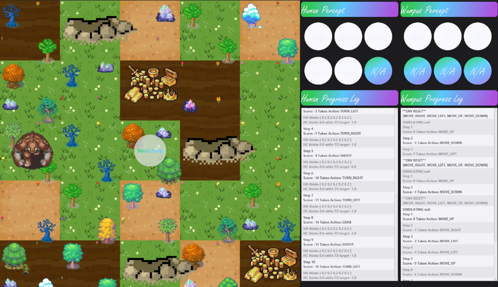
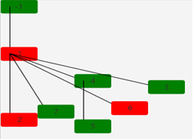
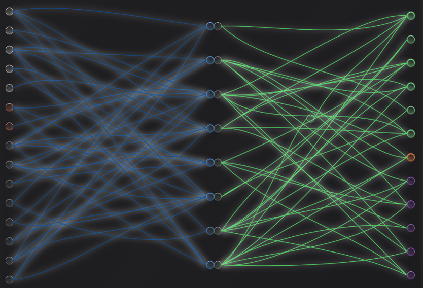
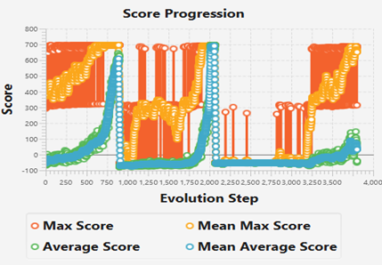
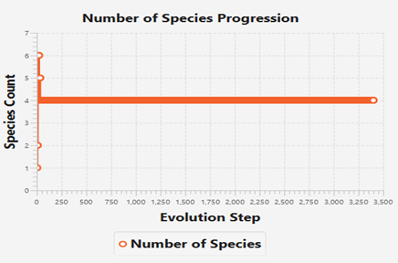
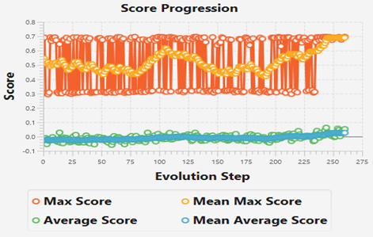
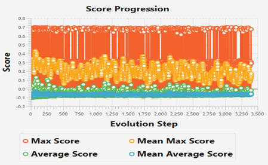

# Generative Adversarial Mutation-Evolution in Augmenting Topologies
### Author: Truong Nguyen Huy - Computer Science - Software Engineering @ University of Illinois at Chicago

## Abstract

This research targets a class of neural controllers that performs directed searches for neural solutions to Partially Observable Markov Decision Processes (POMDPs). The Wumpus World POMDP is selected as the experimentation subject with a novel modification of allowing the Wumpus to move, which adds the factor of dynamic. The goal is to test a hybrid class of AutoML systems that samples neural agent functions under the constraints of a partially observable and dynamic environment. I implement an approximation of the neurogenesis process in biological brains by merging the DAG mutation scheme with the adversarial differentiation of neural cells.

---------------------------------------------------------------------------------------------------------------------------------------------------------------------------------
## I. BACKGROUND AND PROPOSED METHOD
The neural network model has been accredited for its capability of learning robust classes of transformations which helps reduce the need for extensive feature engineering. Gradient-Descent on neural parameters has allowed for the development of diverse end-to-end systems without considerable geometric regularizing. Even though this universal approximability has allowed it to span over diverse densities of function classes on the geometric domain, this is conditioned on the arbitrariness of neural representations. Neural Architecture Search (NAS) addresses this by introducing the notion of search strategies in the space of cell connectivity. Among the diverse classes of NAS, the Evolutionary Algorithm has gained popularity for its resemblance to the natural selection process. Particularly, the Neuroevolution of Augmenting Topologies (NEAT) algorithm represents the process where the Directed Acyclic Graph (DAG) representations of neural structure are enumerated randomly (Stanley & Miikkulainen, 2002). In a different direction of research, Generative Adversarial Neural Architecture Search (GA-NAS) challenged the optimality limitations of NAS by interpolating between importance sampling and the generative adversarial process with reinforcement learning flavor (Rezaei, et al., 2021). In this research, I propose a neural search strategy that systematically merges pointwise topological mutations with this class of generative adversarial. Moreover, analogous to the process of neural cells competing in forming strong connections with neighboring cells, this method demonstrates the adversarial and pointwise mutating perspectives in the neurogenesis process in biological brains.

---------------------------------------------------------------------------------------------------------------------------------------------------------------------------------
## II. METHOD AND EXPERIMENTAL SETUP
### 1. THE POMDP

The Wumpus world is a 5x5 grid where each location can contain agents, pits, and/or gold. The agents' and objects' locations are randomly generated. During experimentation, we also explore fixed configurations of the environment for inspection of the controller's behavior.
The human's PEAS are as follows:

•	The (not crosswise) neighboring locations to a live wumpus's location have a stench that can be perceived by the human. The (not crosswise) neighboring locations to the pit's location have a stench that can be perceived by the human. In the location of the gold, the human can perceive glitter. When the human walks into the grid's border, it stays still and perceives a bump. When the wumpus is killed, a scream can be perceived by the human regardless of its current location on the grid.

•	There are actions to turn right, turn left, and go forward which allows the human to traverse the grid. The action grab can be used to pick up the gold. It is only effective if the human is in the same location as the gold. The action shoot can be used to launch an arrow in a straight line in the direction that the human is facing. The arrow can kill the wumpus if it is in the line of flight. The human only has one arrow but the action can be invoked many times, which has no effects if there is no arrow left.

•	The human gets a massive penalty and the episode terminates if it enters a location containing a pit or a live wumpus. The human gets a massive reward and the episode terminates if it picks up the gold in the gold location. The human also gets minor penalties for each taken action and for bumping into the wall.

Additionally, I have coupled this POMDP design with dynamic and multiagent by adapting the Wumpus's PEAS as follows:

•	The Wumpus can perceive the human's scent in its current location if a human has traversed over it. The scent has a direction and intensity indicator. As time goes on, the scent intensity will decrease and cease to exist at a point.

•	There are actions to go right, left, up, and down which allows the Wumpus to traverse the grid.

•	The Wumpus gets a massive penalty if the human wins the game or if it is killed by the human's arrow. The Wumpus gets a massive reward if it kills the human by co-locating itself with the human's location.

Figure 1: A graphical representation of the described POMDP. The human is at (1, 1) and Wumpus at (1, 3). 

### 2. THE NEAT FRAME
 

Figure 2: A graphical representation of the species tree. Species -1 represents the initial point of the un-speciated population. Green vertices represent existing species while red represent extinct species. “Directed” (top-down direction) edges {A, B} represents the fact that species B originates from species A.

NEAT is implemented as a control for the nondeterministic production of DAGs. My version of NEAT implementation is as follow:

1.	Initialize a primitive population of DAGs with only the frame vertices (input, hidden, and output nodes). The vertices hold the parametrization of neural biases and edges hold the parametrization of neural weights. These components also hold their respective NEAT's innovation identity and Adam optimizer's parameters (Kingma & Ba, 2014). We name the architectural sum of these parts the "genomes" and the neural expressions of them "phenotypes" for the rest of this paper.

2.	Speciate each non-speciated genome using existing species' representatives and a distance function that considers the disjunctions and protrusions of innovation identities, which are hyperparameters.

3.	Optimize the phenotypes in the Wumpus World POMDP to minimize the policy gradient loss which considers a defined reward function.

4.	Collect testing scores from the phenotypes and discard phenotypes with scores below a threshold, which is a hyperparameter.

5.	Calculate species score as the average of its individuals' scores and terminate species with individual counts below a threshold, which is a hyperparameter.

6.	Let top-performing species reproduce by employing a genetic crossover procedure to produce offspring that fill in the spot of displaced individuals. This crossover procedure considers the innovation identities of DAG elements (NEAT is successful thanks to this design). Same-species crossover happens with some probability p and cross-species crossover with (1 - p). Offspring's parametrization inherits parents' parametrization with some rate r.

7.	Mutate the offspring’s DAG using a mutation function. The mutation function should include adding edges and vertices on existing edges. If a vertex C is added on an edge from A to B, the edge from A to B is retained while new edges A to C and C to B are added. This demonstrates the construction of a ResNet architecture (He, Zhang, Ren, & Sun, 2015). Importantly, the mutation function communicates with the mass gene pool so it can record and query innovation identities of newly added edges/vertices. That is, if the edge/vertex is to be added to a genome already existed in the gene pool, that element will use the recorded innovation identity. When a mutation is added to a genome, we also cache the phenotype for optimization convenience.

8.	Apply random mutations to each genome in the mass population and repeat step 2.

Note: innovation identity upper-bound indirectly effects how many hidden nodes we can have in our architectures, which significantly affect genome’s performances. This number also significantly impacts the computation complexity of our NEAT procedures, especially when incorporated with the GAN REINFORCE agents (more on this later). Therefore, due to the lack of computation resources, we restrict our tuning of this number to within the 0-100 range.
 
 
 
Figure 3: A genome’s DAG which demonstrates the structural sparsity of described architectures. The blue region is under Memory Head while the green is under Decision Head. At the leftmost layer, white vertices are observation input head and orange are previous action and state-value input head. At the rightmost region, green vertices are the policy head (actor), orange is the state-value head (critic), and purple is the ICM head (seer). This architecture is generated under an uninformed random mutation function.

We define a full loop of procedures from 2 to 8 as a "generation". Therefore, a complete generation consists of top-performing species with each species consisting of surviving genomes. This implementation guarantees that the influx of aborning genomes and discharge of low-performing genomes are maintained, and the population count is stable, which supports the efficiency of this implementation. Speciation ensures the retention of diverse DAGs of genomes, thus, defending and optimizing a diverse hypothesis space.

At the design level of the phenotypes, a Long Short-Term Memory (LSTM) architecture, named the Memory Head, feeds into an Actor-Critic-Seer architecture, named the Decision Head (Staudemeyer & Morris, 2019). The Memory Head maps sequences of observations and actions to memory encodings. The Decision Head maps memory encodings to the probabilistic distributions of actions (actor head), a continuous value representing the state-value (critic head), and a continuous tuple representing the prediction of the next observation (seer head). The actor determines the policy that the agent is taking and is trained by maximizing the advantage policy gradient objective. The critic estimates the state's values of observation sequences and is trained by minimizing the Temporal Difference error. This value is used to train the actor in the deep Advantage Actor-Critic (A2C) manner (Volodymyr Mnih, Lillicrap, Harley, Silver, & Kavukcuoglu, 2016). The seer predicts the next observations based on past observation sequences and is trained by minimizing the Mean Squared Error with confirmed observations sampled from the dynamics. This is known as the Intrinsic Curiosity Module (ICM) for the curiosity-driven exploration of the policy (Pathak, Agrawal, Efros, & Darrell, 2017). Conceptually, during training, per end-to-end forward pass from percept history to action distribution, value estimation, and observation prediction, the environment returns reward and the next observation which signals optimization of actor, critic, and seer's parameters. The total gradient receipts of these heads are backpropagated through the Memory Head. While LSTM gates, actor, critic, and seer have their respective sets of parameters and internal states, they all share the same DAG with differences in the output head arrangements because each output head specializes in different tasks.

We describe the POMDP and deep A2C framework hyperparameters in the appendix.

### 3. THE GENERATIVE ADVERSARIAL SUPERVISORS

On top of the NEAT process are our generative adversarial "supervisors", the mutator, which follows the GAN generator scheme, and the discriminator, which follows the Siamese scheme. They serve as the mutation function in step 7 of the NEAT generation cycle. Instead of applying random vertex and edge mutations to DAGs as in the original NEAT implementation, the mutator regressively samples pointwise mutations and is trained to maximize an expected return in the REINFORCE manner (Kämmerer, 2019). This return considers the validity of sampled pointwise mutations and the approval of the discriminator on the completed DAG. We choose the most fundamental implementation of REINFORCE because, at this level of the project, the computation resource required is extremely expensive. Additionally, we neglect the use of a baseline in REINFORCE by developing a small-valued reward function, a short episodic time horizon, and minimal exploration for the mutator's MDP. The discriminator takes in two DAGs, one sampled from the distribution of top-performing genomes, and one sampled by the mutator. The discriminator will either agree or disagree that the two are being sampled from the same distribution. The discriminator is optimized to minimize the Cross-Entropy Loss between its outputs and the target labels. Consequentially, over time, DAGs sampled by the mutator will be from the distribution of valid and top-performing genomes. One may wonder where we obtain this distribution of genomes to begin discriminator training. Similar to GANAS, we apply a procedure analogous to importance sampling by retaining and updating a pool of top-performing genomes at each generation. In this fashion, we regressively update our approximation of the optimal distribution towards the true optimal distribution of genomes. We allow each species to host a mutator and a discriminator so they can discover and evaluate diverse classes of architectures in the direction of each species. Therefore, for each species, we retain a pool of top-performing genomes within that species.

We formalize the mutator's MDP as follows:

•	The set of actions available for the mutator is choosing the two endpoint vertices from predetermined innovation identities, which is an upper-bound integer. Implicitly, this choice illustrates that if the two vertices are not connected, an edge is formed in between, else, a new vertex is created on the existing edge.

•	The mutator gets small penalties for invalid choices of vertices. This includes the following scenarios: the two vertices don't exist in the genome, the two vertices form a cycle, the about-to-be-added vertex would exceed the identity upper-bound, the about-to-be-added vertex already exists on the edge between the endpoints. In contrast, the mutator gets small rewards for valid choices. The mutator gets a massive reward or penalty depending on if the final mutated DAG is accepted by the discriminator.

•	At the beginning of each episode, each genome in a species is translated into a DAG representation. The rest of the episode consists of the mutator regressively observing the subject DAG, choosing endpoint vertices, and updating the subject DAG for the next time step. If an innovation identity of zero is chosen at any point, the episode terminates. The episode is also terminated if the max number of iterations is reached. If the final mutated DAG is accepted by the discriminator, that DAG will be parsed onto the genome, else, the original genome is retained.

Note: the mutator can perform actions that involve selecting two endpoints in the range of innovation identities. Each DAG feature and adjacency matrices consider the full range of innovation identities. These two designs raise the computation complexity issue with innovation identity upper-bound significantly. Therefore, future works may consider using DDPG instead of REINFORCE and switching GCN to other GNN methods.

The architecture of the mutator consists of three components: the Graph Convolution Network (GCN) layer (Kipf & Welling, 2017) that reads and encodes the input DAG, the latent Gated Recurrent Unit (GRU) layer (Chung, Gulcehre, Cho, & Bengio, 2014) that memorizes the sequence of observations, and the densely connected MLP layer (Peng, 2017) consisting of two output heads that choose the endpoint vertices.

The architecture of the discriminator consists of two components: the Graph Convolution Network (GCN) layer consisting of two input heads that read and encode two DAGs (one sampled from the true distribution and the other from the mutator's distribution), and the densely connected layer that chooses between accepting or declining that the two DAG are from the same distribution.

We observe a challenge. Because NEAT initializes a uniform primitive population, the pool of top-performing genomes may never be updated, which stagnates the learning procedures of the two supervisors. To avoid this, we initialize a global mutator that samples random mutations and is never optimized. For the first few generations, we run this mutator on each genome in the population in parallel with the process of each species' supervisors optimizing their respective genomes. With this random process, we jump-start speciation and the optimization of each species' supervisors.

---------------------------------------------------------------------------------------------------------------------------------------------------------------------------------
## III. RESULTS AND ABLATION STUDIES
### 1. NEAT WITH MANUALLY TUNED RANDOM MUTATION

We study the case where our implementation of NEAT is used alone with random pointwise mutations on the population of genome's DAGs. That is, the generative adversarial supervisors are ablated. We tune NEAT’s mutation parameters manually and describe the most optimal set in the appendix.

We begin with fixating an environment configuration to study the convergence properties of applying the A2C method to neural agents under the constraint of sparsity. Around generation 800, we observe that the agents consistently reach the highest possible score (~700) in this environment configuration while retaining sparse connectivity architectures. To test the robustness of our method, we steeply change the configuration of the environment. As expected, the agent's score crashes due to the unfamiliar terrains. However, around 1000 generations later, we observe that the agents reach the highest possible score in this new configuration. Remarkably, when we continually switch the configuration back and forth, some agents still manage to perform optimally. That is, there exist architectures that can generalize and effectively interpolate a compromised policy for both environments. As we observe their behaviors in the two environments, their strategies closely resemble each other. For example, the action of turning left in some states in the first environment yields maximal returns. In the second one, even though turning right in some states yields maximal returns, the agents choose to turn left until their resulting orientation is similar to a single right turn. We hypothesize that the initial environment deeply influences the agent's architecture and policy expression as they “grow” up, so they lose the capability of turning right even when their architectures become more complex.
 
 
 
Figure 4: Score progression in NEAT with manually tuned random mutation, a population size of 1000, and “fixed-changed” configured environments. The orange lines represent the maximum score achieved in each generation while the blue/green lines represent the average score with respect to the whole population. We observe that the mass population can catch up exponentially with the global maximal score once a stable optimal policy is discovered by some agents. This demonstrates a good convergence quality of the NEAT process. The first steep decline around generation 800 is due to a change in environment configuration. The second steep decline around generation 2000 is due to another change in environment configuration. We see that in both cases, the population can bring their score performance back up quickly.

We run this ablated controller on randomly configured environments and observe that the agent's policies converge to a local maximum (~300) of staying immobile. These randomly sampled architectures are not robust enough to allow better exploration on randomly sampled terrains. That is, positive rewards are highly sparse in this hostile Wumpus World, and sampled agents cannot develop adequate policies to handle the partial-observability and dynamic nature of the given task.

When running more generations from the initial maximal score generation, we observe that the genome’s architectures become more complex even though further score improvements are impossible. This can be mitigated with an adaptive mutation function that considers the relationship between an architecture with its performance and help us regularize architectural complexity.

### 2. NEAT WITH ADAPTIVE SUPERVISORS

With the addition of the RL generative adversarial controllers, the computation complexity of our research is explosive. Therefore, we introduce minor regularization to the scoring functions to speed up policy convergence of the mutators and phenotypes. Consequentially, the score scale of the human agent will appear lower in later figures. We also decrease the population size down to 100 to minimize speciation explosion which creates too many supervisors to optimize and overflow the memory. Like NEAT, we tune the mutator’s MDP hyperparameters manually and describe the most optimal set in the appendix.

Prospectively, with our method, as the supervisor's losses decrease, the sampled DAGs diversify greatly over the course of the first few generations.
 

Figure 5: We see that the population diversifies into 6 different species in a few starting generations. Over the course of more generations, the number of species reach equilibrium at 4, i.e., four successful species concurrently exist for the rest of this trial.

Interestingly, when observing the behaviors of each species' mutator, we see that for successful species, i.e., species with architectures favored by its discriminator, the mutators sample mutations until maximum time horizon termination. In contrast, in non-successful species, their mutators tend to terminate the sampling process early. This is apparent as sampling more would result in the discriminator's rejection anyways. The mutators understand the optimal directions of architecture sampling while giving up on unproductive architectures.

We use the configuration fixation experiment used in part 1 and observe that the agents reach global maximum at a significantly faster rate even though the population size is significantly decreased.  
 

Figure 6: Under the control of GAN supervisors, a population size of 100, and a fixed-configured environment, score converges towards global optimum (~0.7) in merely 200 generations.

We also observe that when running more generations from the initial maximal score generation, the pool of top-performing genomes stops changing. This results in the mutators stop sampling new mutations and the discriminator’s judgements become approximately indifferent (~50-50). That is, they are in a deadlock position. We conclude that this adaptive mutation framework implicitly understands the relationship between a DAG structure with its phenotype’s performance.

In the condition of arbitrarily configured environments, i.e., the full POMDP, the score fluctuates constantly. However, learned policies are adaptive enough to consistently achieve maximal score (~0.7) in many arbitrarily configured environments.
 

Figure 7: Under the control of GAN supervisors, a population size of 100, and arbitrarily configured environments, score fluctuations occur instead of convergence towards local optimum (~0.2) discovered by NEAT without the supervisors. This is a good quality for convergence as the supervisors are actively steering score progression out of local performance traps.

---------------------------------------------------------------------------------------------------------------------------------------------------------------------------------
## IV. CONCLUSION
During the configuration and revising of this research project, I have reviewed numerous resources in the Reinforcement Learning literature to inspect if state-of-the-art theories are compatible with my framework and if they could solve performance roadblocks:

• In the evolutionist AI approach, I examine the NEAT algorithm. By randomly mutating/permuting DAG structures piecewise, high-performing neural network architectures are discovered. After training, networks leverage their topologically addressable flow paths to optimize an objective function. My personal design decision was that all submodules, including LSTM gates, Actor, and Critic networks, share the same DAG but learn independent latent structures. Overall, NEAT contributes the foundation to regulate diverse structural priors of neural architectures to this research.

• I have also extensively experimented with the connectionist AI approach, i.e., deep learning. I implement the NEAT apparatus to demonstrate deep neural networks under connective sparsity constraints can perform generalization on observatory experiences from high dimensional input sensors. Under the deterministic dynamics of the Wumpus World transition model, the models achieve the global maximum of the objective reward-based function. However, their interpolative faculties are confined to a restricted convex hull of observations drawn from sub-distributions of environmental configurations.

• Due to the factorial volume of high-dimensionality sensory inputs drawn from arbitrarily configured environments, randomly sampled models cannot locally interpolate beyond the sparse and rapidly shifting training distribution. Therefore, I delve into the idea of leveraging the policy-preservative and exploration faculties of the model-based A2C method by implementing clipped gradient, normalized reward function, and the ICM. This contributes immensely to my model's exploration-driven behaviors and stability of learned policies.

• Due to the intractable search space of pointwise DAG mutations, exhaustive (and semi-directional due to the eviction step) architecture search, NEAT, is computationally expensive and may not always converge. I steer my studies towards adaptive generative AutoML models, the GANAS framework, which approaches the unsupervised problem with an RL solution. That is, I implement GAN controllers as REINFORCE agents who render a directional search, samples towards the optimal distribution of piece-wise DAG mutations, and contextualizes the relationships between architectures and their neural performances. 

For future work, we can leverage the ensemble and model-based natures of this framework by encoding the ability for deep models to learn from imagined rollouts and act as targets for each other's training. In brief, given that learners sample action for interaction with the POMDP's transition model, predict state value for learning, and predict subsequence observations via ICM, we can formalize the process of each learner acting as the other's target transition model. This can result in further optimization stability and trajectory sampling efficiency.

---------------------------------------------------------------------------------------------------------------------------------------------------------------------------------
## V. APPENDIX
### Deep A2C hyperparameters
- number of training episodes	3
- number of testing episodes	2
- grid world dimension	5
- episodic time horizon	20
- discount factor	0.98
- lambda in TD-lambda	0.92
- Adam initial learning rate	1e-3

### POMDP reward function
- agent bumps into wall	-0.005
- agent performs an action	-0.001
- agent got the gold	0.7
- agent grabs but miss the gold	-0.01
- agent dies	-0.05
- agent shoots an arrow	-0.005

### NEAT hyperparameters
- genomic distance: excess weight	1.6
- genomic distance: disjoint weight	1.8
- same species distance threshold	2
- eviction rate at each generation	0.2
- species extinction individual count threshold	5
- parameter’s inheritance rate	0.6
- upper-bound innovation identity	32
- population size	100-200

### GAN framework hyperparameters
- size of top-performing individual pool	3
- encoding dimension	16
- training epochs at each generation	5
- max episodic time horizon per epoch	10
- discount factor	0.99
- exploration rate	0.5
- exploration decay rate	0.5
- exploration rate lower-bound	0.01
- number of random-mutation generations	50
- number of mutations per random-mutation	1

### Mutator reward function
- sample an invalid mutation	-0.05
- sample a valid mutation	0.1
- sample add node mutation but max reached	-0.05
- sample add node mutation but already exists	-0.05
- discriminator accepts resulting DAG	0.2
- discriminator rejects resulting DAG	-0.1

---------------------------------------------------------------------------------------------------------------------------------------------------------------------------------
## Acknowledgments
I thank Professor Piotr Gmytrasiewicz and Professor Ian Kash for assistance and advice on the AI-Reinforcement Learning literature.

---------------------------------------------------------------------------------------------------------------------------------------------------------------------------------
## References
Chung, J., Gulcehre, C., Cho, K., & Bengio, Y. (2014). Empirical Evaluation of Gated Recurrent Neural Networks on Sequence Modeling. Retrieved from https://arxiv.org/abs/1412.3555

He, K., Zhang, X., Ren, S., & Sun, J. (2015). Deep Residual Learning for Image Recognition. Retrieved from https://arxiv.org/abs/1512.03385

Kämmerer, M. M. (2019). On Policy Gradients. Retrieved from https://arxiv.org/abs/1911.04817

Kingma, D. P., & Ba, J. (2014). Adam: A Method for Stochastic Optimization. Retrieved from https://arxiv.org/abs/1412.6980

Kipf, T. N., & Welling, M. (2017). Semi-Supervised Classification with Graph Convolutional Networks. Retrieved from https://arxiv.org/abs/1609.02907

Pathak, D., Agrawal, P., Efros, A. A., & Darrell, T. (2017). Curiosity-driven Exploration by Self-supervised Prediction. Retrieved from https://arxiv.org/abs/1705.05363

Peng, Z. (2017). Multilayer Perceptron Algebra. Retrieved from https://arxiv.org/abs/1701.04968

Rezaei, S. S., Han, F. X., Niu, D., Salameh, M., Mills, K., Lian, S., . . . Jui, S. (2021). Generative Adversarial Neural Architecture Search. Retrieved from https://arxiv.org/abs/2105.09356

Stanley, K. O., & Miikkulainen, R. (2002). Evolving Neural Networks through Augmenting Topologies. Retrieved from The MIT Press Journals: http://nn.cs.utexas.edu/downloads/papers/stanley.ec02.pdf

Staudemeyer, R. C., & Morris, E. R. (2019). Understanding LSTM -- a tutorial into Long Short-Term Memory Recurrent Neural Networks. Retrieved from https://arxiv.org/abs/1909.09586

Volodymyr Mnih, A. P., Lillicrap, T. P., Harley, T., Silver, D., & Kavukcuoglu, K. (2016). Asynchronous Methods for Deep Reinforcement Learning. Retrieved from https://arxiv.org/abs/1602.01783
