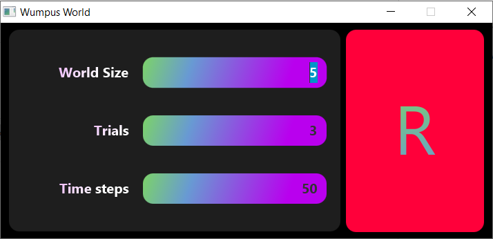

# WumpusWorld - Independent Research Project
## Project's name: Explore the Development of A NEAT Multi-Agent Wumpus World
#### Author: Truong Nguyen Huy
#### At University of Illinois at Chicago

##### Figure 1: The login screen of the program. User can specify the world' size, number of trials, and number of time steps for the simulation

This research is based on the Wumpus World concept in Artificial Intelligence by Michael Genesereth and Wumpuslite model designed in Java by Professor James P. Biagioni in CS 511 – Artificial Intelligence II at UIC. Under Professor Piotr Gmytrasiewicz’s guidance, I have added the factor of Multiagent to the model's environment simulation by giving the Wumpus a baseline agent paradigm.

The utility for the human agent is to maximize its performance measure by reaching the gold while maintaining the highest possible score, which is calculated based on a reward/penalty system. The utility of the Wumpus agent is to maximize its performance measure by terminating the human agent while maintaining its highest possible score, which is also calculated based on its respective reward/penalty system. The agents competing in this environment are expected to perform logical reasoning in order to maximize their respective scores. At a minimum, the agents are expected to have the capabilities of learning, and knowledge-based agent models.

This research will first, focus on implementing the propositional logic and NeuroEvolution of Augmenting Topologies (NEAT - by Ken Stanley) algorithm with regards to the model's design. This is expected to be done by the end of the Fall 2020 semester. In the second phase of the research, which is the final phase occurring in Spring 2021, the model will be run, tested, and supervised for further development to observe how the agents behave and become "successful" in this competitive environment.

##### Figure 2: A randomly generated simulation scene. In this scene, the human agent is right below the wumpus agent (notice that the human is sensing a stench and the wumpus is feeling a bump because it tried to move right and hit the world border)
